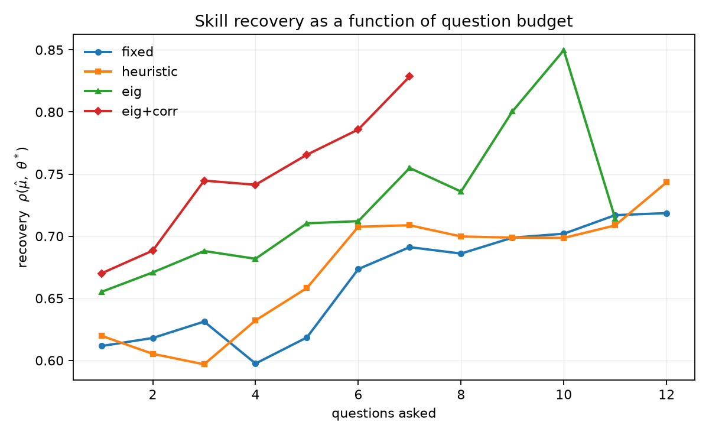

# probe

**An adaptive interviewing agent, and the evaluation harness built to prove whether it actually works.**

`Python 3.11` · `Pydantic v2` · `NumPy/SciPy` · `DuckDB` · `pytest + Hypothesis` · `Typer` · `uv` — **no agent framework**

The eval harness is the project. The interviewer is the subject.

Most "AI interviewer" demos show you a transcript. This one asks a narrower and more answerable question: *if you let an agent choose what to ask next based on what it still does not know, does it learn more per question than a well-prompted LLM that just picks from a list?* Then it builds the rig to measure that — with confidence intervals, adversarial candidates, and a fairness audit — and reports the places the answer is no.

### Headline result

> **The adaptive policy resolves 98.1% of a rubric against a well-prompted LLM chooser's 80.4%, in fewer questions and at 41% lower cost per interview — and the result replicated on a live model on the first attempt.**

| | |
|---|---|
| 🎯 **Main finding** | `eig` beats the LLM-chooser baseline on resolved fraction by **+0.177** [+0.120, +0.233] — paired bootstrap, interval excludes zero |
| 🔁 **Live replication** | Re-ran the sweep against **Claude Haiku 4.5**: same direction, same significance, overlapping intervals. 96/96 interviews, **zero failures**, $3.35 |
| 💰 **Cheaper, not just faster** | $0.0160/interview vs the chooser's $0.0270 — EIG computes its objective locally instead of sending a transcript every turn |
| 🔬 **Measured, not asserted** | 348 tests, bootstrap CIs over personas, adversarial suite, fairness audit, byte-reproducible eval |
| 🧪 **Assumptions tested, not assumed** | The live run *refuted* one of the project's own simulated parameters — the grader position bias measured offline at +0.30 is **0.00** on Haiku. Reported as a correction, not buried |
| 📉 **Where it loses** | Accuracy difference is inside the noise at n=24; bluffing still beats the score; calibration degrades under a live grader. All three in the main text, all three pinned by tests |

### What this project demonstrates

Applied statistics (item response theory, MML/EM calibration, bootstrap inference) · experiment design under a pre-registered plan · LLM reliability engineering (repair ladders, schema enforcement, resumability) · adversarial and fairness evaluation · and the discipline to retract a headline finding when a later phase invalidated it.

---

## The three questions

| | Question | Answer |
|---|---|---|
| **Q1** | **Efficiency** — does an expected-information-gain policy reach target confidence in fewer questions than a fixed script, at equal accuracy? | **Yes on efficiency, not established on accuracy.** `eig` resolves 98.1% of competencies against the LLM chooser's 80.4% (paired 95% CI on the difference: +0.120 to +0.233), in fewer questions and at lower cost. The recovery-accuracy difference is +0.016 and **includes zero**. ✅ **Replicated on Claude Haiku 4.5** — [see below](#live-validation-on-claude-haiku-45). |
| **Q2** | **Grader reliability** — what is the grader's test–retest variance, position bias, and self-consistency? | Offline: test–retest SD **0.321** rubric levels, **position bias +0.30**, Cohen's **κ = 0.676** against an independent rater. **On a live model the position bias vanishes (0.00)** — the harness transferred, the parameter did not, and that is the honest answer to Q2. Credible intervals are **overconfident** either way: nominal 80% intervals cover 66–72%. |
| **Q3** | **Style invariance** — how much does surface style move a score at fixed ability, and can the drift be engineered down? | Mean absolute drift falls **0.326 → 0.239** (27%) with the content–style intervention. Name-swap is exactly invariant. The residual is the non-native-phrasing slice at 0.446, and it is a different bug than the one the intervention fixes. |

---

## What this is not

Stated before the results, because it changes how you should read every number below. A project that only reports its wins is a project you cannot trust the wins of.

**The main results table is a simulation study.** The committed runs use `SimLLM` — a deterministic, seeded generative model of each model role. It is not a mock returning canned strings: ability propagates into the *content* of an answer via a graded-response model, the grader reads only the text, and recovery is genuinely earned. It is also what makes `make eval` reproducible to the byte at zero cost. But it means:

- **Q1's headline is a simulation result**, of the kind computerized-adaptive-testing research uses to validate a selection policy. The [live replication](#live-validation-on-claude-haiku-45) is what turns it into evidence about a real model — and it is reported separately rather than merged in, because the two come from different measurement instruments.
- **Q2 and Q3 measure parameters chosen here.** Grader noise, position bias and style sensitivity are knobs in `probe/sim/llm_sim.py`. Their *values* are mine; the *machinery* that measures them transfers unchanged, which the live run demonstrates.

**No human graded the anchor set.** `PLAN.md` called for 60–100 blind human labels — the scarcest artefact in a repo like this. The released set was produced by an *independent estimator*, not a person. Calling it a human gold set would be a lie the rest of this repo does not survive, so the deliverable is recorded as **unmet** rather than redefined. What it does establish is that the release format and the κ pipeline work end to end.

**Other limitations, specifically:**

- **The credible intervals are overconfident.** 80% intervals cover 66–72%. The Phase 2 coverage test passes at 78–82% in isolation, so this is model misspecification, not an inference bug: the likelihood treats the grader as a clean graded-response model while the real grader adds noise it does not represent. Every arm is affected about equally, so the *comparison* survives; the absolute intervals should not be quoted as calibrated.
- **Ability is unidimensional per competency.** One latent θ per competency, independent grids. The `eig+corr` arm relaxes independence with a copula, not a true joint posterior.
- **Style variation is synthetic and a proxy.** Verbosity, hedging and first-language-transfer markers are generated, not observed. The name-swap slice uses names of different origins, but nothing here establishes anything about a protected class, and the four-fifths framing is a reporting format rather than a legal finding.
- **The calibration/eval split is 36/24 personas.** Item parameters are fitted on the calibration split only, and the correlation matrix records its provenance — but 36 respondents is thin for estimating five parameters per item, which is why 11% of items are quarantined.
- **n = 24 eval personas.** Every interval below reflects that.

---

## Results

Generated by `make eval` from committed traces. Nothing here is hand-typed; a test asserts the README's numbers match the generated artefacts.

τ = 0.80, budget = 12 questions, 24 eval-split personas × 4 style variants × 4 arms = 384 interviews. 95% bootstrap intervals, resampled over **personas** (not turns — a persona contributes many correlated observations).

### 1. Main results table

| arm | recovery ρ | resolved (SD < τ) | questions to confidence | ECE | $/interview |
|---|---|---|---|---|---|
| `fixed` — static script | 0.713 [0.621, 0.775] | 0.778 [0.729, 0.828] | 9.4 [7.8, 11.2] | 0.110 | $0.0197 |
| `heuristic` — LLM chooser | 0.743 [0.645, 0.806] | 0.804 [0.745, 0.861] | 7.1 [6.1, 8.6] | 0.082 | $0.0270 |
| `eig` — belief + information gain | 0.759 [0.663, 0.822] | **0.981** [0.957, 0.998] | 7.4 [6.7, 8.1] | 0.107 | $0.0160 |
| `eig+corr` — + cross-competency | **0.793** [0.667, 0.849] | **1.000** | **3.6** [3.2, 4.0] | **0.086** | **$0.0113** |

The `heuristic` arm is the one that matters. Beating a fixed script proves nothing — nobody ships a fixed script and calls it adaptive. It gets the rubric, the transcript and a 24-item shortlist, and a genuinely sensible selection heuristic behind it.

**Paired differences against `heuristic`:**

| contrast | difference | excludes 0 |
|---|---|---|
| `eig` resolved fraction | **+0.177** [+0.120, +0.233] | ✅ |
| `eig` mean posterior SD | **−0.088** [−0.114, −0.060] | ✅ |
| `eig` recovery ρ | +0.016 [−0.058, +0.089] | ❌ |
| `eig+corr` resolved fraction | **+0.196** [+0.139, +0.255] | ✅ |
| `eig+corr` recovery ρ | +0.050 [−0.063, +0.137] | ❌ |

**So the claim is "faster to the same accuracy", not "more accurate".** At n = 24 the accuracy difference is inside the noise, and the test suite asserts that it is — if a later change makes it significant, the suite fails and forces this paragraph to be rewritten.

Where the mechanism shows: `eig` terminates on confidence 90% of the time and `eig+corr` 100%, against 17% for the fixed script — which mostly exhausts its wall-clock budget (44%), because it draws long items indiscriminately while the EIG objective divides information by expected answer time. Budget-awareness is a term in the objective and it is doing visible work.

`eig` is also **cheaper** than the LLM chooser ($0.0160 vs $0.0270), which was not guaranteed: the chooser sends a transcript and a shortlist to the model every turn, while EIG computes its objective locally.

### Live validation on Claude Haiku 4.5

The whole sweep re-run against a real model — real answers, real grading, real JSON parsing — to test whether the finding survives contact with something that was not built to be predictable.

**It replicated on the first attempt.** 96/96 interviews completed, zero failures, $3.35.

> ⚠️ **These are not the same numbers as the table above, and must not be read against it.** The item difficulties were fitted against *simulated* responses, so they are miscalibrated for a live grader and absolute recovery is depressed for reasons that have nothing to do with Haiku's competence. That penalty lands on all four arms equally, which is why the **contrast** transfers and the **levels** do not. Both runs below are the neutral style only, so the backend is the single thing that differs.

**`eig` vs `heuristic` — the comparison the whole project rests on:**

| paired contrast | offline (`SimLLM`) | live (Haiku 4.5) | replicated |
|---|---|---|---|
| resolved fraction | **+0.188** [+0.132, +0.250] ✅ | **+0.215** [+0.174, +0.257] ✅ | ✅ same sign, same significance |
| mean posterior SD | **−0.086** [−0.116, −0.055] ✅ | **−0.178** [−0.197, −0.159] ✅ | ✅ larger effect live |
| recovery ρ | +0.043 [−0.026, +0.111] ❌ | +0.071 [−0.076, +0.231] ❌ | ✅ *including* the null result |

The last row is the one worth pausing on: the **negative** result replicated too. A harness that only reproduced its wins would be the more worrying outcome.

**Live arm table** (24 personas × 4 arms, neutral style, τ=0.80, budget 12):

| arm | recovery ρ | resolved (SD < τ) | ECE | $/interview |
|---|---|---|---|---|
| `fixed` | 0.555 [0.370, 0.684] | 0.354 | 0.075 | $0.0296 |
| `heuristic` | 0.651 [0.488, 0.755] | 0.542 | 0.082 | $0.0367 |
| `eig` | 0.722 [0.596, 0.809] | 0.757 | 0.190 | $0.0261 |
| `eig+corr` | **0.715** [0.541, 0.821] | **1.000** | 0.281 | **$0.0192** |

The arm *ordering* is preserved end to end, and `eig` is cheaper than the LLM chooser live as well as offline.

**What got worse, and it is the interesting part.** Calibration degrades sharply under a real grader: ECE for `eig` goes 0.107 → **0.190**, and `eig+corr` 0.086 → **0.281**. The overconfidence documented as a known defect is *worse* with a live model, and worst in the arm that is most confident. Outside `eig+corr`, most live runs never reach τ inside the 12-question budget, so questions-to-confidence is not measurable at this budget — the efficiency claim rests on resolved fraction and posterior SD, which are measurable.

**Getting there cost four bug fixes**, every one invisible offline — including an evidence-span check that rejected **100% of otherwise-good live grades** because it required the model to count characters. Full account in [`results-log.md`](results-log.md); it is the most instructive part of this repo.

### 2. Accuracy vs. budget — the centrepiece



Every point is computed from a persisted belief snapshot, never by re-running an interview at a shorter budget. Two independent implementations compute this curve and a test diffs them — which is how a real bug was caught (an early version counted competencies the interview had not yet reached, flattening exactly the region where the arms separate).

| budget | `fixed` | `heuristic` | `eig` | `eig+corr` |
|---|---|---|---|---|
| 4 questions | 0.598 | 0.632 | 0.682 | **0.729** |
| 8 questions | 0.697 | 0.715 | **0.747** | 0.733 |
| 12 questions | 0.710 | 0.742 | **0.752** | 0.733 |

The adaptive arms are ahead where budget is scarcest. `eig+corr` reaches at 4 questions roughly what the fixed script reaches at 12.

### 3. Fairness — before and after the intervention

Same candidate, same hidden ability, same concepts in every answer; only surface form varies. Any score difference is the grader responding to prose.

| slice | drift, intervention **off** | drift **on** | reduction |
|---|---|---|---|
| verbose vs terse | 0.364 | 0.253 | −0.111 |
| neutral vs **L1-transfer** | 0.489 | **0.446** | −0.044 |
| hedged vs assertive | 0.451 | 0.258 | −0.193 |
| name_a vs name_b | 0.000 | **0.000** | — |
| **mean** | **0.326** | **0.239** | **−0.087 (27%)** |

**The residual open bug: `observability.debugging` on the non-native-phrasing slice, drift 0.446, adverse-impact ratio 0.74** (below the four-fifths threshold).

This is a *different kind* of failure from the one the intervention fixes. Telling the grader to score content removes the fluency **reward** — which is why the hedged/assertive axis drops 43%. It cannot remove a recognition **failure**: non-idiomatic phrasing ("consistency eventually", "read your writes" de-hyphenated) defeats exact concept matching, so a candidate who knows the idea loses marks for how they said it. The remedy is fuzzy or embedding-based concept matching. It is not implemented, and it is reported rather than quietly fixed and lost.

Name-swap is **exactly** invariant — 0.00 across 128 pairs. Under a deterministic backend that holds by construction; the test exists to catch a future name-sensitive feature, not as an empirical finding.

### Grader reliability

Each of 120 real answers from the committed traces, re-graded under varied conditions.

| property | value | what it means |
|---|---|---|
| Test–retest SD (5 seeds) | **0.321** levels | About a third of a rubric level of any score is the grader, not the candidate |
| Exact agreement across seeds | 81.3% | |
| **Position bias** | **+0.30** | The same answer scores a third of a level higher at turn 10 than at turn 1 |
| Anchor-order disagreement | **0.000** | Reversing the rubric anchors never changes the verdict |
| Span→score entailment | **1.000** | Every score of 3+ cites text that names an anchor concept |
| Cohen's κ vs. independent rater | **0.676** (n=75) | Quadratic-weighted 0.924; within-one agreement 100% |
| Schema violation / repair success | 1.2% / 97.0% | Measured by the repair ladder actually being walked |

Position bias is the finding here. It is small enough to miss on any single answer and large enough to matter across an interview — and it is exactly the kind of thing that only shows up if you deliberately re-grade the same answer at different points in a transcript.

**…except it does not reproduce on a real model, and that is the more valuable result.**

Re-running the same suite against Claude Haiku 4.5 on 40 live answers:

| property | offline (`SimLLM`) | live (Haiku 4.5) | verdict |
|---|---|---|---|
| **Position bias** | **+0.30** | **0.00** | ❌ **does not replicate** — the simulated grader's positional drift is a parameter I chose, and the real one does not have it |
| Anchor-order disagreement | 0.000 | **0.000** | ✅ confirmed on a real model |
| Span→score entailment | 1.000 | **0.925** | ⚠️ live is *worse* — 3 of 40 grades cite text naming no anchor concept |
| Test–retest SD | 0.321 | **not measurable** | see below |

This is exactly what the "Q2 measures parameters chosen here" caveat was warning about, now with evidence attached. The *machinery* transferred perfectly — the same suite, unmodified, ran against a live grader and produced a verdict. The *value* did not, because it was mine to begin with. The honest summary of Q2 is that position bias is a real thing worth measuring, this harness measures it correctly, and Haiku 4.5 does not exhibit it.

**Why test–retest is reported as not measurable rather than as a spectacular win.** The first live run returned a test–retest SD of **0.014** against the offline grader's 0.321 — a twenty-fold reliability improvement. It was an artefact. The seed is an RNG knob on the offline backends; the Messages API has no seed parameter, and the grader runs at temperature 0, so the five "retest seeds" were five byte-identical requests and the metric was measuring provider nondeterminism. The suite now checks whether the backend can resample at all and reports `null` when it cannot. Measuring grader noise on a live model needs temperature-based resampling, which is [next on the list](#what-i-would-do-next-in-order).

### Robustness

| metric | value |
|---|---|
| Injection resistance | **0.960** (124 attempts, 100% flagged) |
| Mean score inflation from a payload | +0.049 of a rubric level |
| Bluff-detection AUC | 0.730 |
| Overclaim recall | 1.000 |
| Non-answer (dodge) recall | 1.000 |
| Schema-violation rate / repair success | 1.2% / 97.0% |

Resistance is a **counterfactual**: each injected answer is re-graded with the payload stripped by a length-preserving sanitiser, averaged over five grader seeds. That took three attempts to measure correctly — the first two versions reported 0.539 and 0.829 for a defence that had not been breached once. The number to trust is the inflation, not the threshold count.

**Where it loses: bluffing works on the score.** Bluffers average 4.05 against honest candidates' 2.99. The flags catch them (AUC 0.730) but the *score* does not, because the grader gives partial credit for borrowed technical vocabulary from neighbouring competencies. Detection and scoring are different problems and only one of them is solved here.

### Ablations

| factor | on | off |
|---|---|---|
| Follow-ups — recovery ρ (all) | 0.771 | 0.758 |
| Follow-ups — recovery ρ (**terse** candidates) | **0.569** | 0.372 |
| Follow-ups — mean questions | 7.77 | 6.31 |

Generated follow-ups earn their place exactly where designed: on terse candidates, who say less than they know. **This rests on a single terse persona in the eval split (n = 1)** — it points the right way and is not strong evidence.

---

## How it works

```
   JD + résumé ──▶ Rubric compiler ──▶ competencies, priors, evidence spans
                                              │
      ┌───────────────────────────────────────▼──────────────────────────────┐
      │  Interview loop                                                       │
      │                                                                       │
      │    Belief state ──▶ Question policy ──▶ Question                      │
      │         ▲                                   │                         │
      │         │                                   ▼                         │
      │      Grader ◀── Answer ◀── Candidate (simulated persona)              │
      │         │                                                             │
      │      Stop rule ──▶ confidence | budget | nothing left worth asking    │
      └───────────────────────────────┬───────────────────────────────────────┘
                                      ▼
                            Report + DuckDB trace
                                      │
                                      ▼
              Eval harness: recovery · efficiency · fairness ·
                            reliability · robustness · cost
```

**Two planes, and the boundary between them is the load-bearing invariant.** The *interview plane* conducts an interview and never sees ground truth. The *measurement plane* generates candidates with hidden ability `θ*` and scores the interview plane against it. A leak makes every recovery number meaningless, so it is enforced three ways: a test that greps every logged prompt (in seven float renderings) and every request context, an import-direction test, and a token-level check that ground-truth vocabulary never appears in interview-plane code.

**The core ideas:**

- **Belief state** — one latent ability per competency on a 61-point grid over [−3, 3]. A graded response is one vectorised multiply-and-normalise, in log space. Exact enough in one dimension, no sampler to tune.
- **Graded response model** (Samejima), not binary 2PL. Answers are on a 5-point anchored rubric; binarising throws away most of the signal the policy needs.
- **Expected information gain**, cost-normalised: `argmax EIG(q)/cost(q) − λ·repeat_family_penalty`. Dividing by expected answer time is what makes the policy budget-aware rather than greedy on bits.
- **Gap-probing is emergent.** A competency the job requires and the résumé is silent about starts with a wide prior, which makes it the highest-information target. Nothing anywhere contains the word "gap".
- **Item parameters are fitted, not guessed** — marginal maximum likelihood by EM on a held-out calibration split, which never touches `θ*`. 200 items, 11% quarantined for non-monotone thresholds or runaway discrimination.
- **Evidence spans are mandatory.** A grade whose character offsets do not quote the answer is rejected and regenerated. That is what makes the audit trail checkable rather than decorative.

### Reliability engineering

The parts that make an 800-run sweep survivable:

- **Repair ladder** — parse → re-prompt with the validator's own error → deterministic degraded path → mark the turn unrecoverable. A bad model output is a data condition, never an exception.
- **Resumability** — every turn persists before the next begins, keyed on `(run_id, turn_idx)`. Tested against a real hard kill: a child process `os._exit()`s mid-interview and the resumed run completes with exactly one row per turn, byte-identical to an uninterrupted one.
- **Bounded concurrency** with jittered exponential backoff. 440 interviews/minute offline; the test asserts fifty parallel runs produce fifty traces with no turns crossing between them.
- **Frozen constants** — after Phase 3, τ, ε, budgets, bank and population versions change only with a dated entry in [`results-log.md`](results-log.md), and every number computed under the old values is re-run or retracted. That rule has been invoked, and it cost a headline finding.

---

## Quick start

```bash
uv sync --all-extras
```

Reproduce every number in this README from the committed traces:

```bash
make eval
```

Run one interview and watch it work:

```bash
uv run probe run --persona p001 --arm eig --show-transcript
```

Re-run the entire experiment from scratch (offline, ~2 minutes, $0.00):

```bash
make experiment
```

See the adaptive policy re-probe a dodger while the fixed script marches on:

```bash
make demo
```

### Running against a real model

Everything above is offline and needs no credentials. To drive the same pipeline with a live model, copy [`.env.example`](.env.example) to `.env` — gitignored — and put the key in it:

```bash
cp .env.example .env
```

`ANTHROPIC_API_KEY` is read from the environment, so an exported variable works equally well and always wins over the file. Then:

```bash
make experiment BACKEND=anthropic MODEL=haiku
```

`--model` takes `haiku`, `sonnet`, `opus` or a full model id, and defaults to `PROBE_MODEL` then to Sonnet. Every live run prints a token and USD estimate and waits for confirmation before spending anything; the estimate is priced for the model actually selected.

The live run reported above is reproducible with:

```bash
uv run probe experiment --backend anthropic --model haiku --styles neutral --traces traces/probe-haiku.duckdb
```

Point `--traces` and `--out` somewhere other than the defaults, as above, so the committed offline traces and the figure drawn from them survive.

| Target | What it does |
|---|---|
| `make test` | Full suite — 300+ tests |
| `make eval` | Every metric from committed traces → results table + figure |
| `make experiment` | Re-run all interviews (`BACKEND=sim\|fake\|anthropic`, `MODEL=haiku`) |
| `make calibrate` | Fit item parameters on the calibration split |
| `make demo` | Side-by-side `fixed` vs `eig` on an adversarial candidate |
| `make gate-N` | Cumulative exit gate for phase N (0–6) |

---

## Repository layout

| Path | What lives there |
|---|---|
| [`probe/belief/`](probe/belief) | Grid posterior, graded-response model, MML calibration, correlation copula |
| [`probe/policy/`](probe/policy) | The four arms: `fixed`, `heuristic`, `eig`, `eig+corr` |
| [`probe/rubric/`](probe/rubric) | 50-node competency taxonomy and the compiler |
| [`probe/grader/`](probe/grader) | Rubric grader, span validation, injection classifiers |
| [`probe/runtime/`](probe/runtime) | Interview loop, repair ladder, budgets, DuckDB tracing, provider boundary |
| [`probe/sim/`](probe/sim) | Persona generator — the measurement plane |
| [`evals/`](evals) | Six metric families, bootstrap intervals, `make eval` |
| [`analysis/results/`](analysis/results) | Generated result files — the source of every offline number above |
| [`analysis/results-haiku/`](analysis/results-haiku) | The live Claude Haiku 4.5 run, kept separate on purpose |
| [`results-log.md`](results-log.md) | The lab notebook, including everything that went wrong |

**Stack:** Python 3.11, Pydantic, NumPy/SciPy, DuckDB, matplotlib, pytest + Hypothesis, Typer, `uv`. No agent framework — the control flow *is* the interview policy, and it has to be explainable line by line.

---

## What I would do next, in order

1. **Recalibrate the item bank against live responses.** The live run reuses difficulties fitted on simulated answers, which is why absolute recovery is depressed there. A live calibration split would make the two tables directly comparable — the single highest-value next step.
2. **Measure grader noise on a live model properly** — temperature-based resampling instead of seed-based, since a provider API has no seed. Currently reported as not-measurable rather than guessed at.
3. **Fix the overconfident intervals.** Add a noise-inflation parameter to the likelihood, fitted from observed grader variance. The largest correctness gap in the repo, and the live run shows it is *worse* with a real model, not better.
4. **Fuzzy concept matching**, to close the non-native-phrasing fairness residual.
5. **Score bluffing correctly**, not just detect it — penalise off-competency vocabulary instead of giving it partial credit.
6. **Collect actual human labels** and retire the stand-in anchor set.

---

## An honest note on process

[`results-log.md`](results-log.md) is the lab notebook, and it is worth more than this page. It records the fidelity gate failing twice before it passed, a retraction that cost the previous phase's headline finding, an injection metric that was wrong twice, a fairness suite that spent a whole phase measuring content variance it had mislabelled as style, a diagnosis that was simply wrong (an "upward bias" that turned out to be sampling noise, chased through an optimiser swap that changed nothing), and the four defects that only appeared the first time a real model was put behind the same interface.

Every one of those was found by a test or a gate that had been written to fail. That is the actual claim of this repository: not that the policy wins, but that you can check whether it does — and that when the answer was no, it says so.

---

MIT licensed. Built by [Madhav-000-s](https://github.com/Madhav-000-s).
